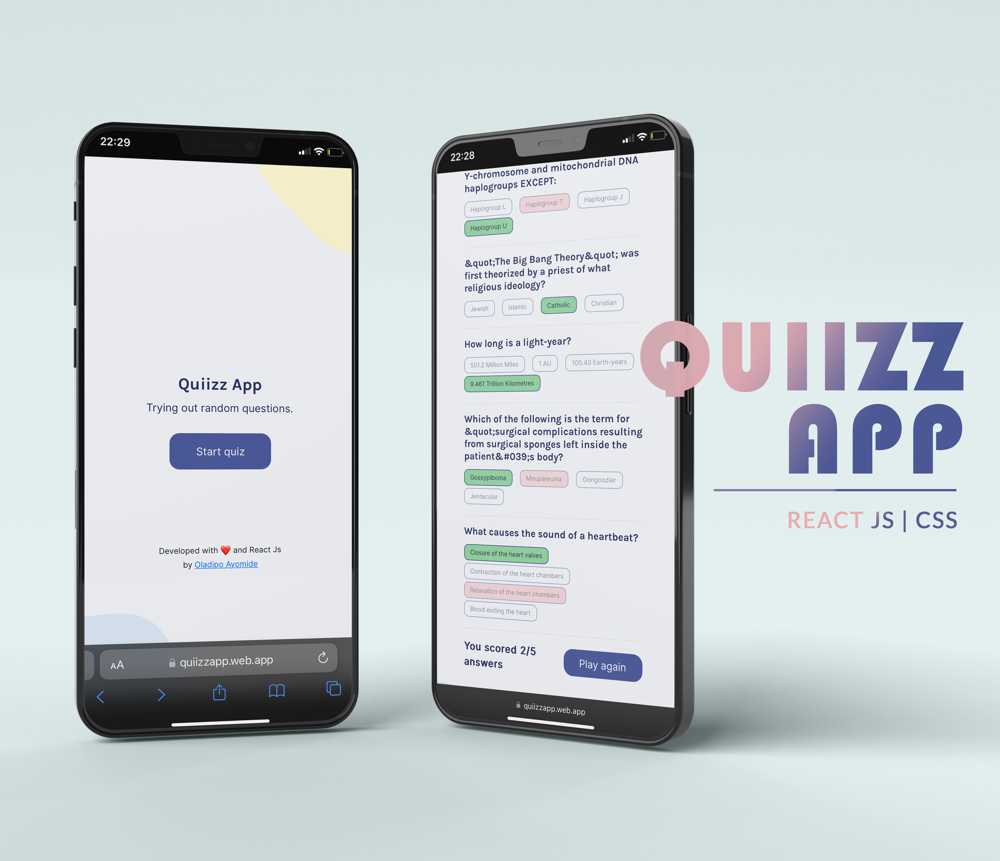

# Oladipo Ayomide

I'm Ayomide a frontend developer with a great experience on HTML, CSS and Javascript. I'm currently mastering the use of React Js to handle website application development plus handling of data from different APIs. I am always open to learn new and more modernised tech ideas and innovations in the tech world. Let's connect on <a target="_blank" rel="noreferrer noopener" href="https://www.linkedin.com/in/oladipoayomide/">LinkedIn.</a> I'm always open to new ideas and coding problem solving.

## Skills and Experience
* ⚛  React js
* 💻 HTML, CSS and JS

## Examples of Works

